<div align="center">

<a href="https://code.jiangshu.ai/awesome-design-html/">
  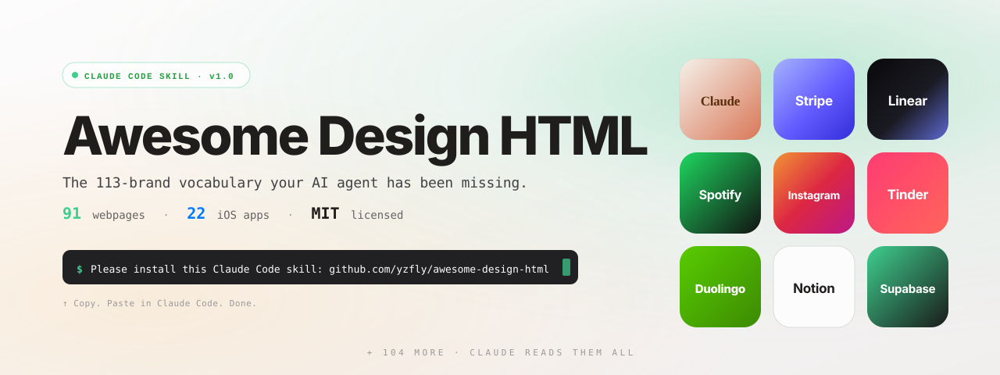
</a>

<a href="README.md"></a>
<a href="README.zh-CN.md"></a>

<a href="LICENSE"></a>
<a href="#-网页库--93-个营销页"></a>
<a href="#-ios-库--22-个-app-仿真"></a>
<a href="https://docs.claude.com/claude-code"></a>
<a href="https://github.com/yzfly/awesome-design-html/stargazers"></a>
<a href="https://github.com/yzfly/awesome-design-html/releases"></a>

<p>
<b><a href="https://code.jiangshu.ai/awesome-design-html/">🎨 在线画廊</a></b>
&nbsp;·&nbsp;
<b><a href="#-怎么用">⚡ 安装</a></b>
&nbsp;·&nbsp;
<b><a href="#-为什么是-html不是-markdown">💡 为什么 HTML?</a></b>
&nbsp;·&nbsp;
<b><a href="#-精选-demo--直接看不用脑补">⭐ 浏览 115 个</a></b>
</p>

</div>

---

## ⚡ 怎么用

> **两种方式,挑顺手的用。**

### 方式 1 · AI 原生方式 —— 复制一句话,粘贴,搞定

在任意 Claude Code 会话里,复制粘贴这句话:

```
帮我安装这个 Claude Code skill: https://github.com/yzfly/awesome-design-html
```

Claude 会自动 clone 仓库到 `~/.claude/skills/`。**就这一步**。装完之后,你提到任何品牌名时,skill 都会**自动加载** —— 不用敲斜杠命令,不用任何特殊语法。像平时一样说话就行:

```
"做个 Linear 风格的产品页"
"参考 Stripe 的 hero 渐变 mesh"
"做个 Spotify Now Playing 的 iPhone 仿真"
"Duolingo 那种立体阴影按钮"
"做个 Cursor 风的暗色 IDE 落地页"
```

Claude 会自动读取对应的参考 HTML,提取真实品牌的 token(色彩、字体、圆角、按钮形态)并精准应用。

> **手动安装**(如果你想自己来): `git clone https://github.com/yzfly/awesome-design-html.git ~/.claude/skills/awesome-design-html`
>
> **打包下载**: 从 [Releases](https://github.com/yzfly/awesome-design-html/releases) 下载 `.zip`,扔进 `~/.claude/skills/` 目录。

### 方式 2 · 直接拿你喜欢的页面(不需要装 skill)

每个 demo 都是**完整独立的单文件 HTML** —— 所有 CSS、字体、token 全部内联。点开下面任意链接,保存(`Cmd+S` / `Ctrl+S`),就拿到了一份完整的品牌风格模板,可以直接改。

---

## 💡 为什么是 HTML,不是 Markdown?

AI 项目的文档写法正在悄悄发生转向:**从 Markdown README 转向自说明的 HTML**。这个观点 Karpathy、Anthropic / Claude Code 团队和很多人都讲过,核心其实很简单:

- **HTML 是活的。** Markdown 写"圆角蓝色按钮",读者要靠想象;HTML 文件**就是结果本身** —— LLM 和人看到的是同一组像素。
- **一个文件胜过千行散文。** 一个 300 行的 HTML demo 在 30 秒内传达色值、字体阶梯、动效、交互;Markdown 规范覆盖同样的范围要花几小时,信息还会丢失。
- **AI 原生读 HTML。** 现代编程 agent(Claude Code、Cursor、Copilot)能直接解析 HTML,不需要"翻译层"。
- **作品本身就是文档。** 不再有"规范 vs 实现"的漂移 —— 因为根本没有分离的规范。

**这个 skill 就是建立在这个理念上。** 115 个参考全部都是自说明的 HTML 页面。你不是读 Stripe 网格渐变的描述 —— 你打开 Stripe 的 HTML,渐变**就在那**。Claude 读同一个文件,应用同一套 token。

所以这个项目叫 `awesome-design-html`,不叫 `awesome-design-md`。

---

## ⭐ 精选 demo — 直接看,不用脑补

> 24 张精选预览。点击任意缩略图打开完整 live demo。

### AI 顶流

<table>
<tr>
<td width="25%" align="center"><a href="https://code.jiangshu.ai/awesome-design-html/assets/web/design.claude.html">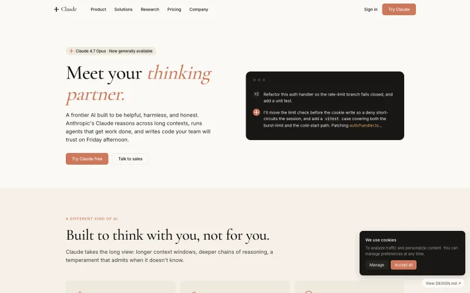<br/><sub><b>Claude</b></sub></a></td>
<td width="25%" align="center"><a href="https://code.jiangshu.ai/awesome-design-html/assets/ios/design.chatgpt-ios.html">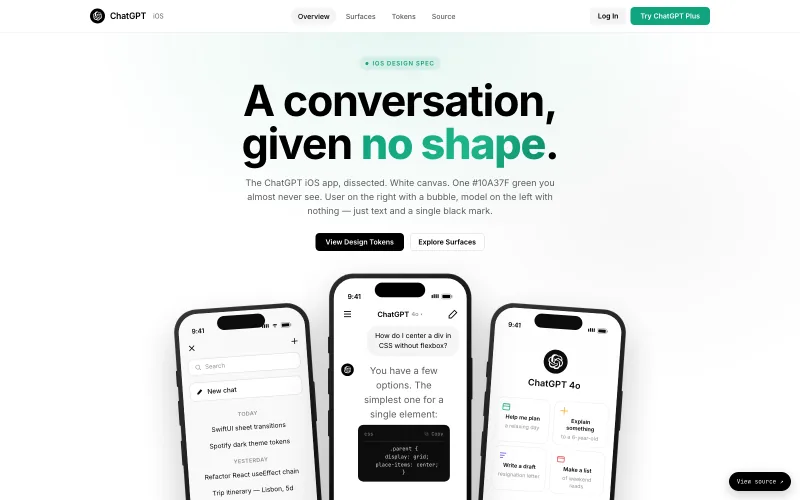<br/><sub><b>ChatGPT iOS</b></sub></a></td>
<td width="25%" align="center"><a href="https://code.jiangshu.ai/awesome-design-html/assets/web/design.cursor.html">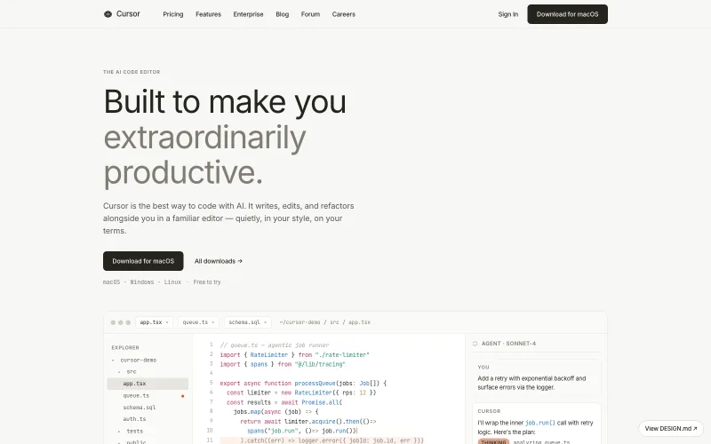<br/><sub><b>Cursor</b></sub></a></td>
<td width="25%" align="center"><a href="https://code.jiangshu.ai/awesome-design-html/assets/web/design.supabase.html">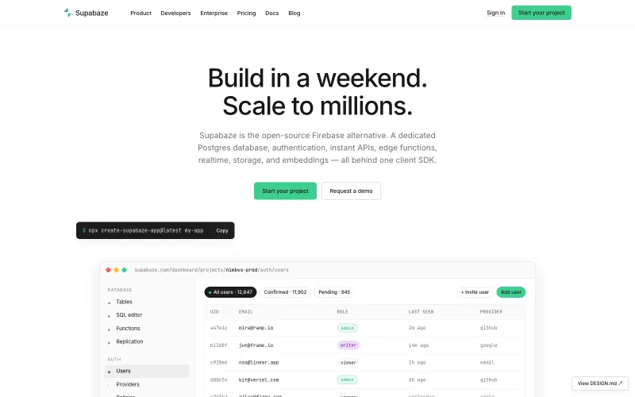<br/><sub><b>Supabase</b></sub></a></td>
</tr>
<tr>
<td align="center"><a href="https://code.jiangshu.ai/awesome-design-html/assets/web/design.opencode.html">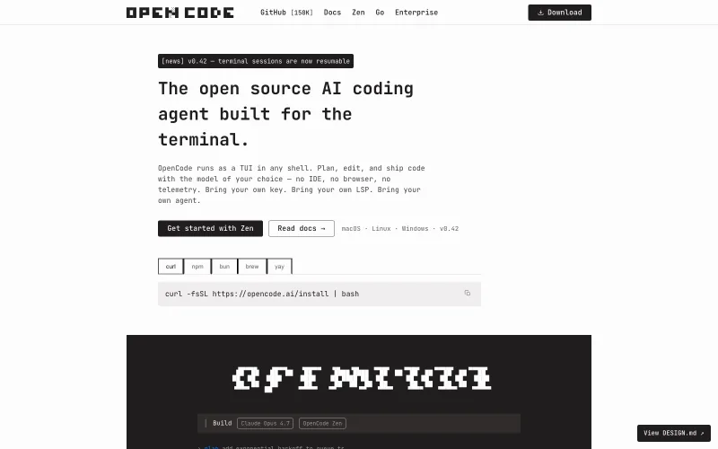<br/><sub><b>OpenCode</b></sub></a></td>
<td align="center"><a href="https://code.jiangshu.ai/awesome-design-html/assets/web/design.mistral.html">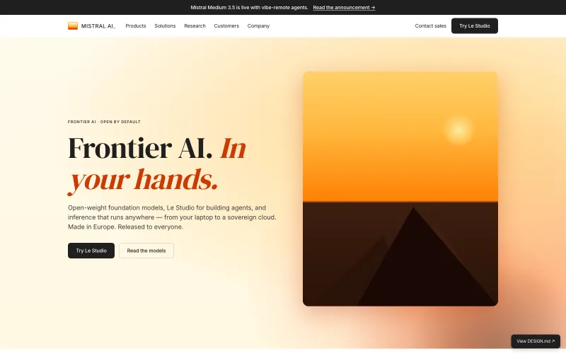<br/><sub><b>Mistral</b></sub></a></td>
<td align="center" colspan="2"><sub>更多 AI: Cohere · ElevenLabs · Lovable · MiniMax · Ollama · Runway · Together · VoltAgent · xAI — <a href="#-网页库--93-个营销页">见网页库</a></sub></td>
</tr>
</table>

### iOS · 视觉冲击

<table>
<tr>
<td width="25%" align="center"><a href="https://code.jiangshu.ai/awesome-design-html/assets/ios/design.tinder-ios.html">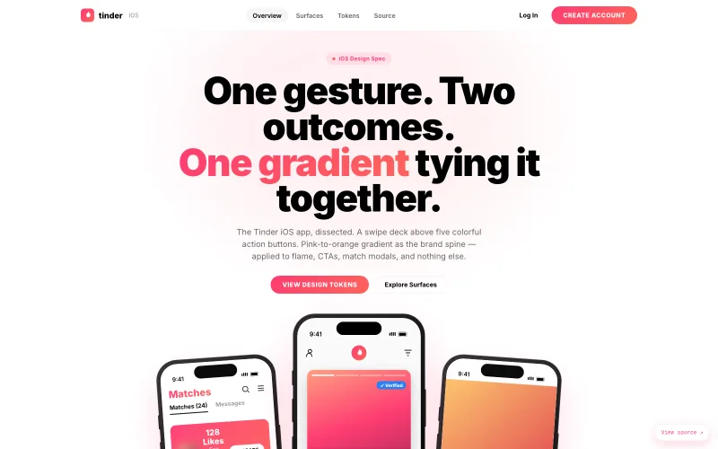<br/><sub><b>Tinder</b></sub></a></td>
<td width="25%" align="center"><a href="https://code.jiangshu.ai/awesome-design-html/assets/ios/design.duolingo-ios.html">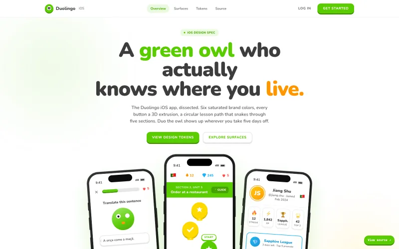<br/><sub><b>Duolingo</b></sub></a></td>
<td width="25%" align="center"><a href="https://code.jiangshu.ai/awesome-design-html/assets/ios/design.instagram-ios.html">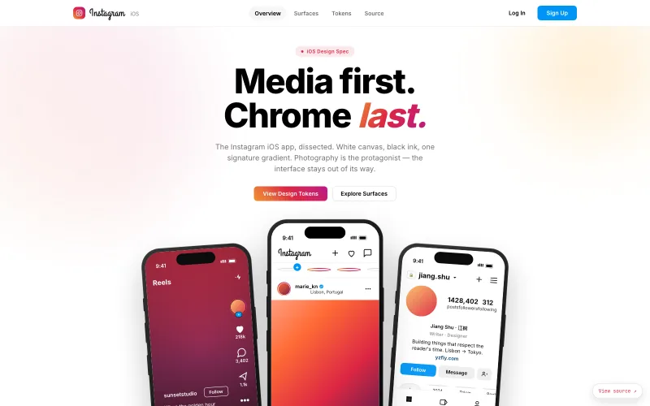<br/><sub><b>Instagram</b></sub></a></td>
<td width="25%" align="center"><a href="https://code.jiangshu.ai/awesome-design-html/assets/ios/design.snapchat-ios.html">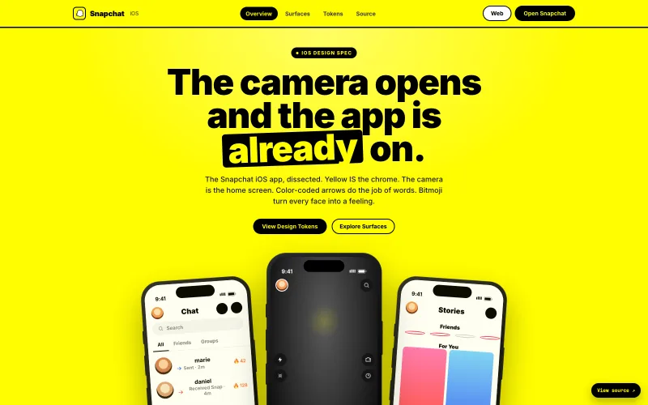<br/><sub><b>Snapchat</b></sub></a></td>
</tr>
<tr>
<td align="center"><a href="https://code.jiangshu.ai/awesome-design-html/assets/ios/design.spotify-ios.html">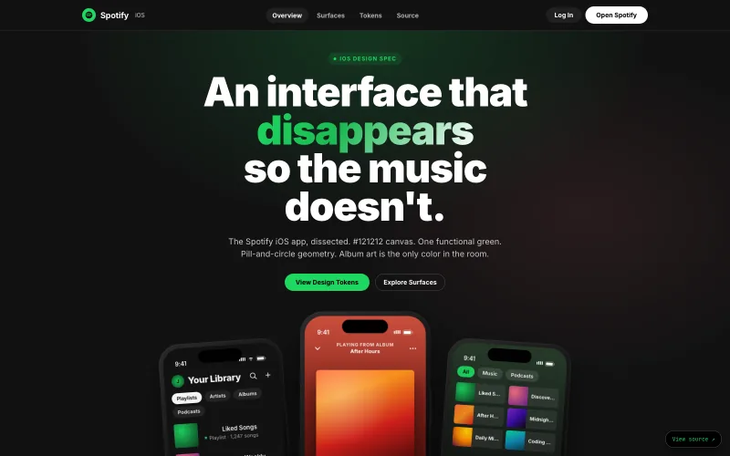<br/><sub><b>Spotify iOS</b></sub></a></td>
<td align="center"><a href="https://code.jiangshu.ai/awesome-design-html/assets/ios/design.whatsapp-ios.html">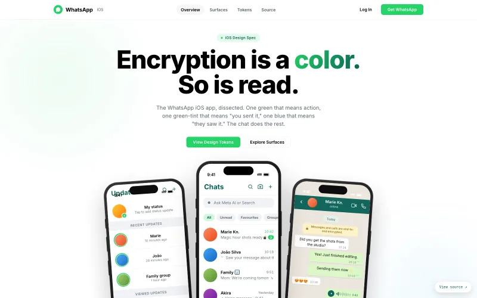<br/><sub><b>WhatsApp</b></sub></a></td>
<td align="center" colspan="2"><sub>更多 iOS: Apple Music · Discord · DoorDash · Hinge · Netflix · Notion · Robinhood · Starbucks · Telegram · Threads · TikTok · Uber · X / Twitter · YouTube — <a href="#-ios-库--22-个-app-仿真">见 iOS 库</a></sub></td>
</tr>
</table>

### Web · 高级感

<table>
<tr>
<td width="25%" align="center"><a href="https://code.jiangshu.ai/awesome-design-html/assets/web/design.stripe.html">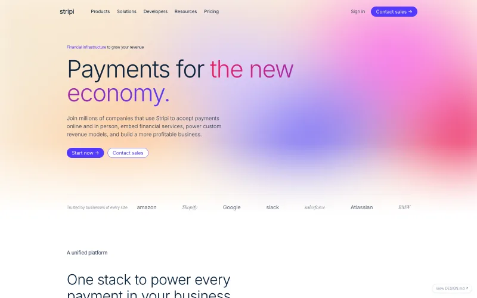<br/><sub><b>Stripe</b></sub></a></td>
<td width="25%" align="center"><a href="https://code.jiangshu.ai/awesome-design-html/assets/web/design.linear.html">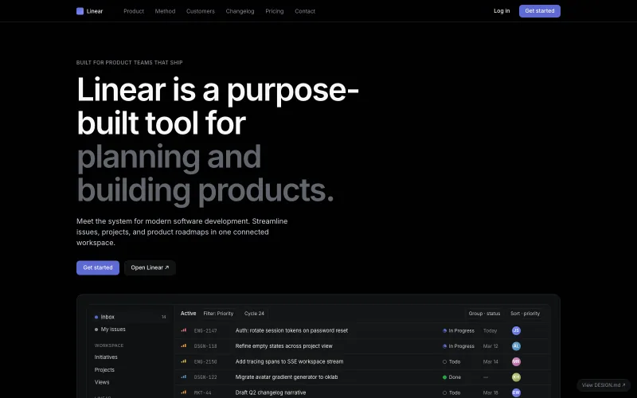<br/><sub><b>Linear</b></sub></a></td>
<td width="25%" align="center"><a href="https://code.jiangshu.ai/awesome-design-html/assets/web/design.notion.html">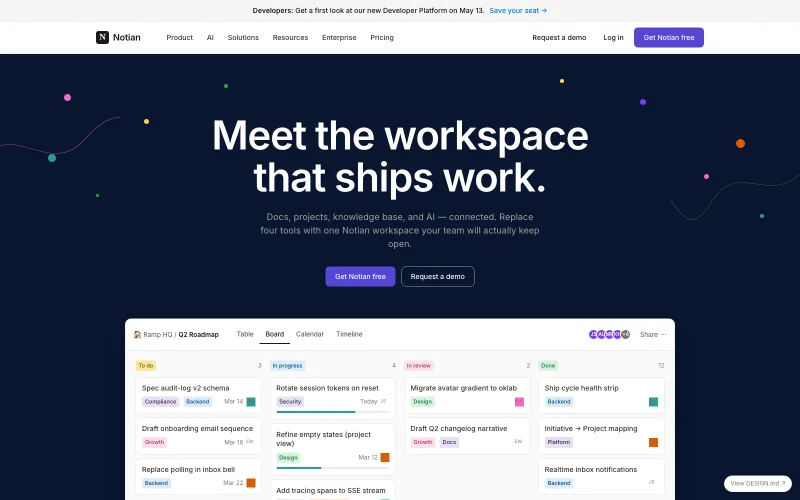<br/><sub><b>Notion</b></sub></a></td>
<td width="25%" align="center"><a href="https://code.jiangshu.ai/awesome-design-html/assets/web/design.vercel.html">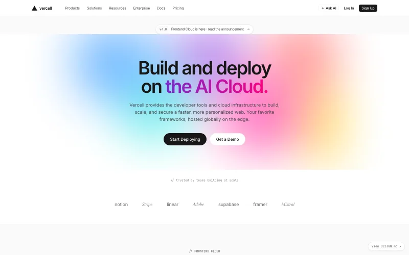<br/><sub><b>Vercel</b></sub></a></td>
</tr>
<tr>
<td align="center"><a href="https://code.jiangshu.ai/awesome-design-html/assets/web/design.figma.html">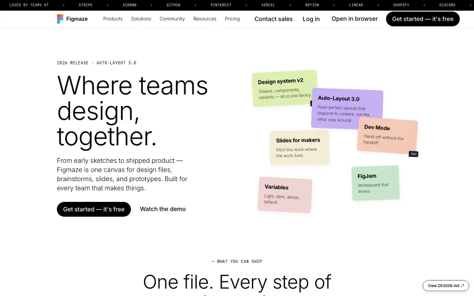<br/><sub><b>Figma</b></sub></a></td>
<td align="center"><a href="https://code.jiangshu.ai/awesome-design-html/assets/web/design.airbnb.html">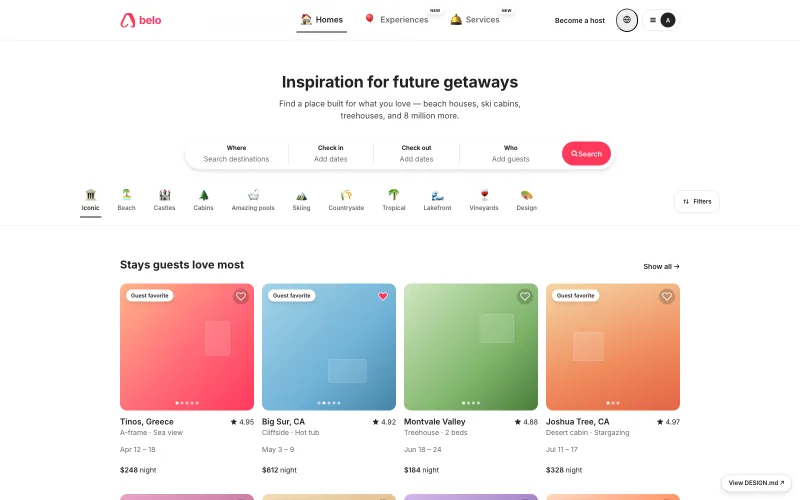<br/><sub><b>Airbnb</b></sub></a></td>
<td align="center" colspan="2"><sub>更多: Airtable · Cal.com · Intercom · Miro · Slack · Superhuman · Webflow · Zapier · Clay — <a href="#-网页库--93-个营销页">见网页库</a></sub></td>
</tr>
</table>

### 奢华 · 经典

<table>
<tr>
<td width="25%" align="center"><a href="https://code.jiangshu.ai/awesome-design-html/assets/web/design.apple.html">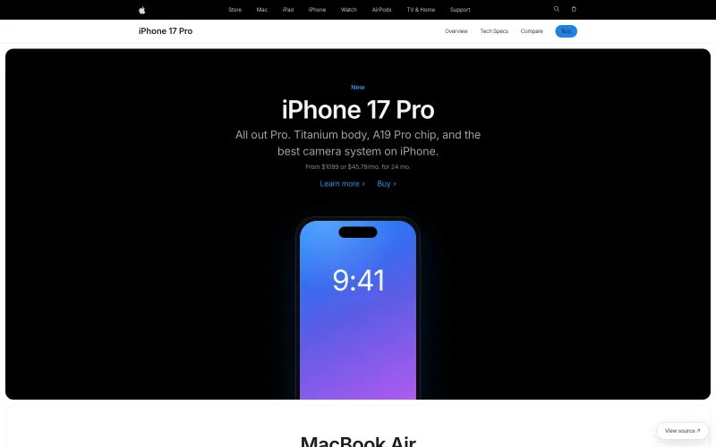<br/><sub><b>Apple</b></sub></a></td>
<td width="25%" align="center"><a href="https://code.jiangshu.ai/awesome-design-html/assets/web/design.tesla.html">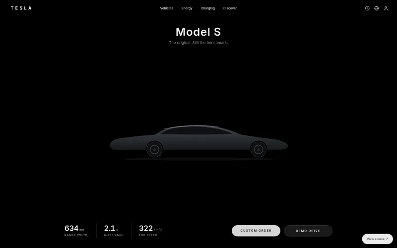<br/><sub><b>Tesla</b></sub></a></td>
<td width="25%" align="center"><a href="https://code.jiangshu.ai/awesome-design-html/assets/web/design.ferrari.html">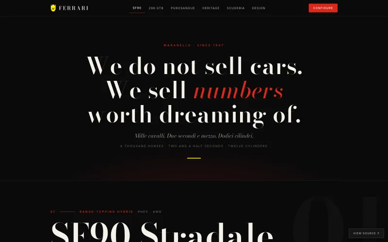<br/><sub><b>Ferrari</b></sub></a></td>
<td width="25%" align="center"><a href="https://code.jiangshu.ai/awesome-design-html/assets/web/design.bmw-m.html">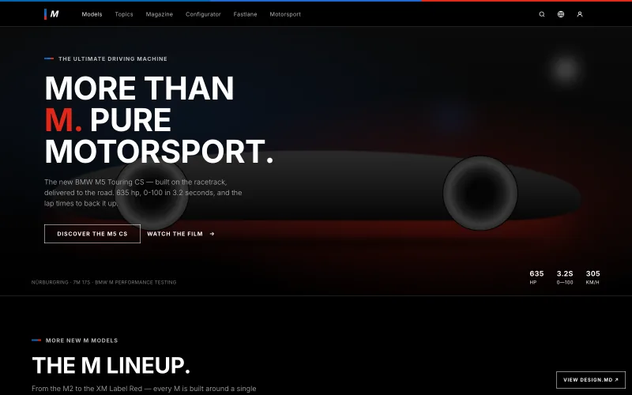<br/><sub><b>BMW M</b></sub></a></td>
</tr>
<tr>
<td align="center"><a href="https://code.jiangshu.ai/awesome-design-html/assets/web/design.bugatti.html">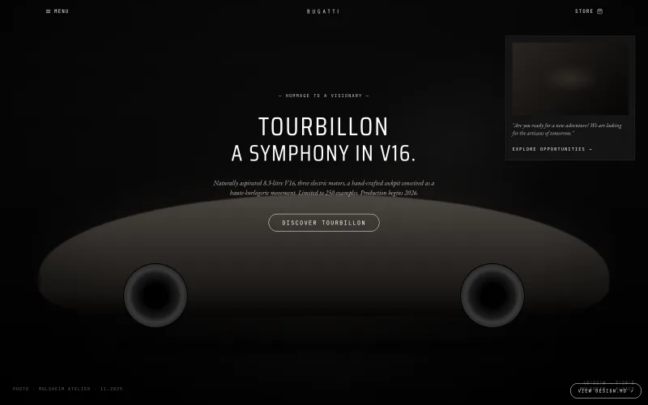<br/><sub><b>Bugatti</b></sub></a></td>
<td align="center"><a href="https://code.jiangshu.ai/awesome-design-html/assets/web/design.lamborghini.html">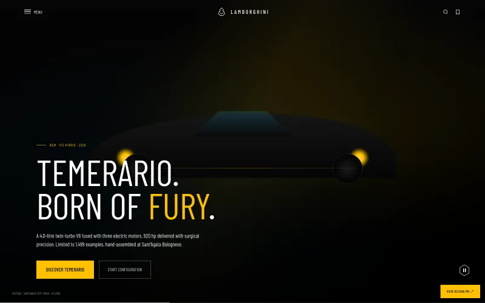<br/><sub><b>Lamborghini</b></sub></a></td>
<td align="center" colspan="2"><sub>更多: BMW · Renault — <a href="#-网页库--93-个营销页">见网页库</a></sub></td>
</tr>
</table>

## 🇨🇳 中国大厂 — 22 个新品牌 (2026)

第一个面向 AI 编程 agent 的**中国大厂设计参考集**。每个 demo 都是品牌真实 hex 值、真实字体、真实排版,完整 Part B 设计系统参考节。

### 字节 · 阿里 · 腾讯

<table>
<tr>
<td width="25%" align="center"><a href="https://code.jiangshu.ai/awesome-design-html/assets/web/design.feishu.html">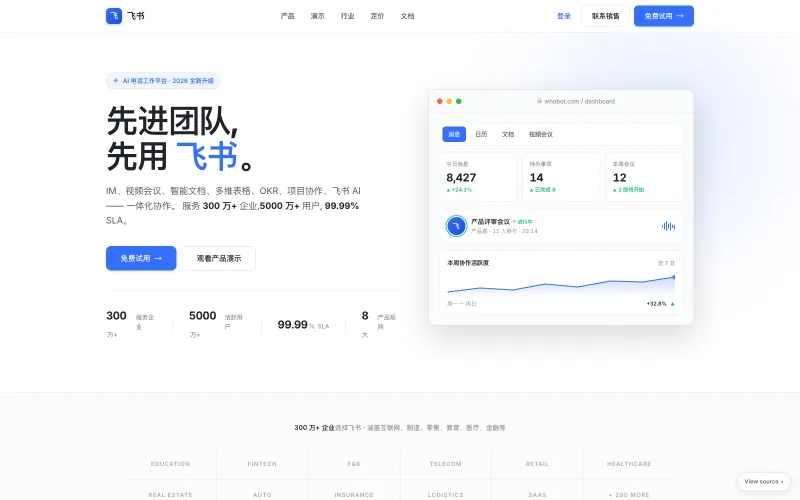<br/><sub><b>飞书 Feishu</b></sub></a></td>
<td width="25%" align="center"><a href="https://code.jiangshu.ai/awesome-design-html/assets/web/design.douyin.html">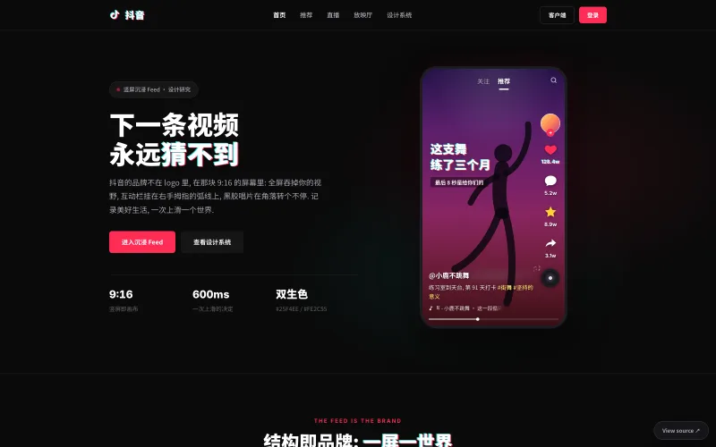<br/><sub><b>抖音 Douyin</b></sub></a></td>
<td width="25%" align="center"><a href="https://code.jiangshu.ai/awesome-design-html/assets/web/design.doubao.html"><br/><sub><b>豆包 Doubao</b></sub></a></td>
<td width="25%" align="center"><a href="https://code.jiangshu.ai/awesome-design-html/assets/web/design.aliyun.html"><br/><sub><b>阿里云</b></sub></a></td>
</tr>
<tr>
<td align="center"><a href="https://code.jiangshu.ai/awesome-design-html/assets/web/design.alipay.html"><br/><sub><b>支付宝</b></sub></a></td>
<td align="center"><a href="https://code.jiangshu.ai/awesome-design-html/assets/web/design.dingtalk.html"><br/><sub><b>钉钉</b></sub></a></td>
<td align="center"><a href="https://code.jiangshu.ai/awesome-design-html/assets/web/design.yuque.html">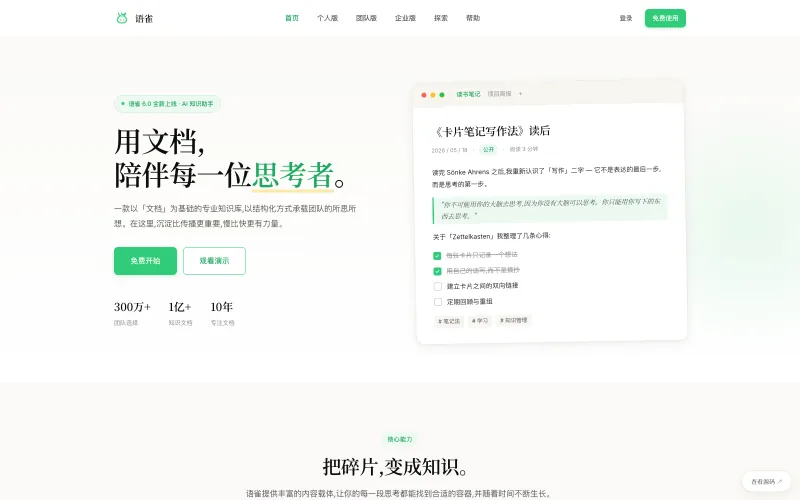<br/><sub><b>语雀</b></sub></a></td>
<td align="center"><a href="https://code.jiangshu.ai/awesome-design-html/assets/web/design.tencent-cloud.html">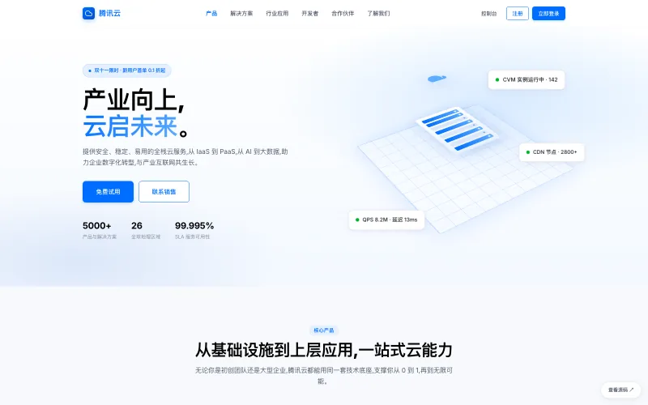<br/><sub><b>腾讯云</b></sub></a></td>
</tr>
<tr>
<td align="center"><a href="https://code.jiangshu.ai/awesome-design-html/assets/web/design.wechat.html">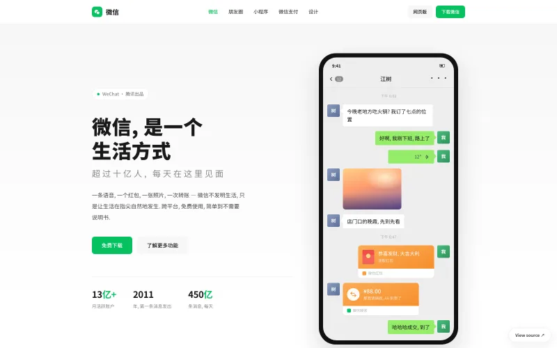<br/><sub><b>微信 WeChat</b></sub></a></td>
<td colspan="3"></td>
</tr>
</table>

### 国产 AI

<table>
<tr>
<td width="25%" align="center"><a href="https://code.jiangshu.ai/awesome-design-html/assets/web/design.deepseek.html">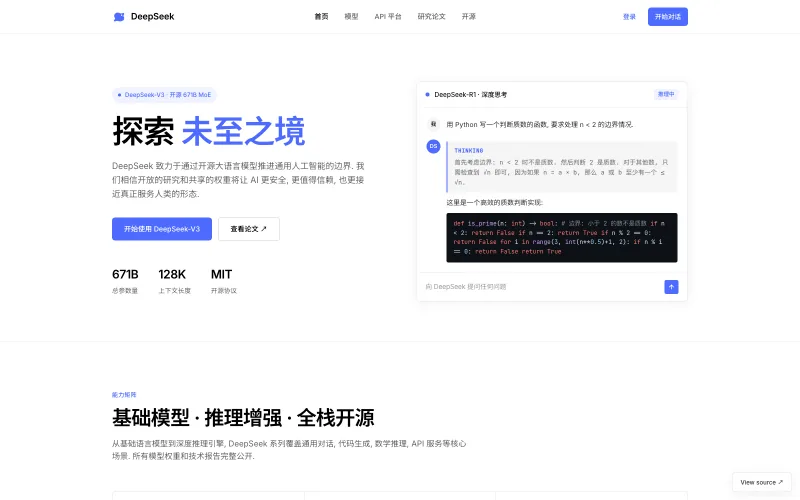<br/><sub><b>DeepSeek</b></sub></a></td>
<td width="25%" align="center"><a href="https://code.jiangshu.ai/awesome-design-html/assets/web/design.kimi.html">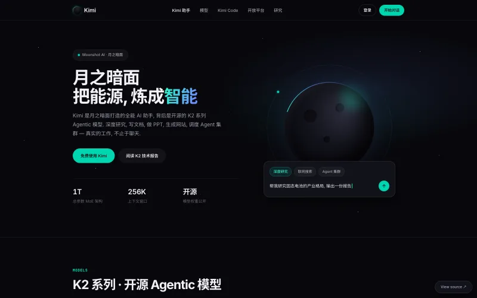<br/><sub><b>Kimi</b></sub></a></td>
<td width="25%" align="center"><a href="https://code.jiangshu.ai/awesome-design-html/assets/web/design.wenxin.html">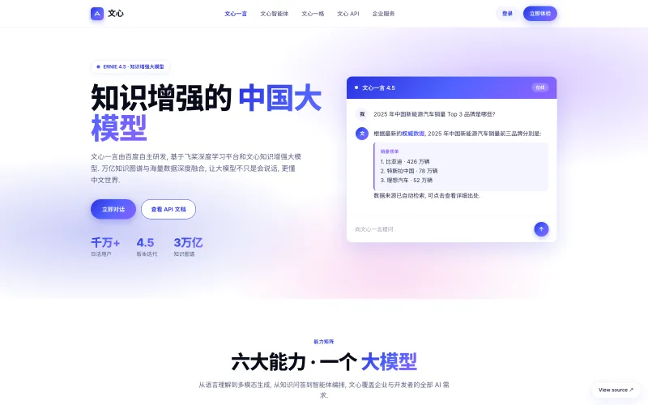<br/><sub><b>文心一言</b></sub></a></td>
<td width="25%" align="center"><a href="https://code.jiangshu.ai/awesome-design-html/assets/web/design.qwen.html">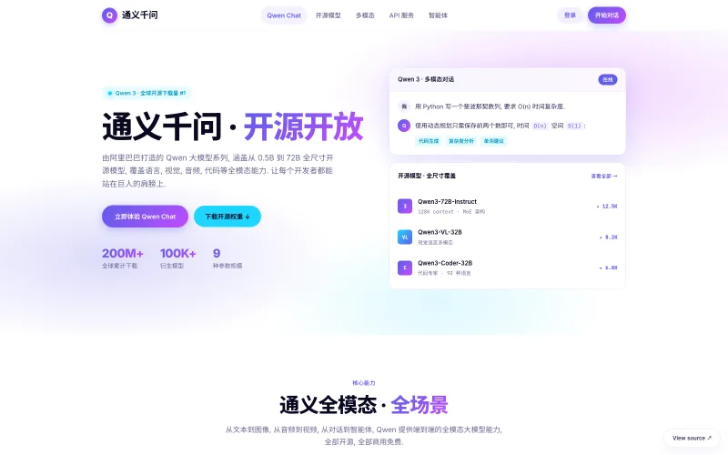<br/><sub><b>通义千问</b></sub></a></td>
</tr>
</table>

### 新能源车

<table>
<tr>
<td width="25%" align="center"><a href="https://code.jiangshu.ai/awesome-design-html/assets/web/design.xiaomi-ev.html">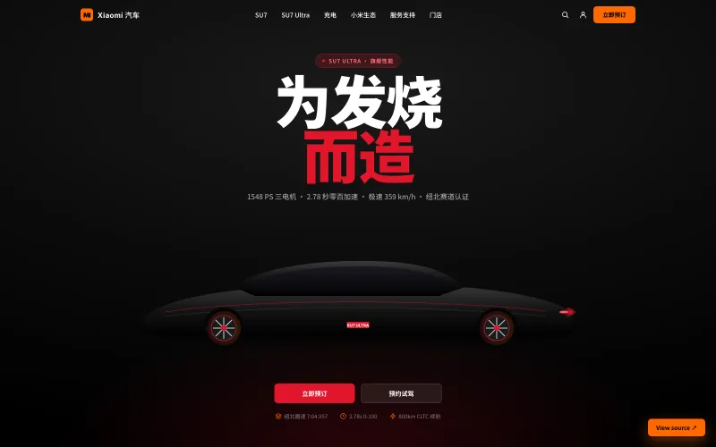<br/><sub><b>小米汽车</b></sub></a></td>
<td width="25%" align="center"><a href="https://code.jiangshu.ai/awesome-design-html/assets/web/design.nio.html">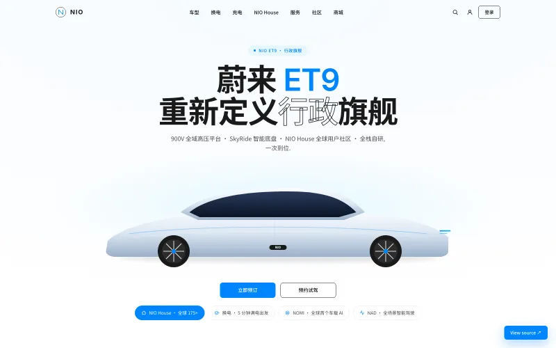<br/><sub><b>蔚来 NIO</b></sub></a></td>
<td width="25%" align="center"><a href="https://code.jiangshu.ai/awesome-design-html/assets/web/design.li-auto.html">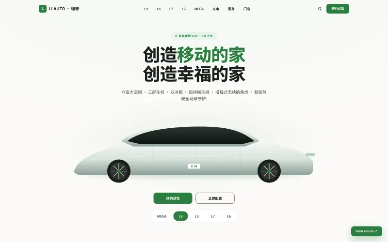<br/><sub><b>理想 Li Auto</b></sub></a></td>
<td width="25%" align="center"><a href="https://code.jiangshu.ai/awesome-design-html/assets/web/design.zeekr.html">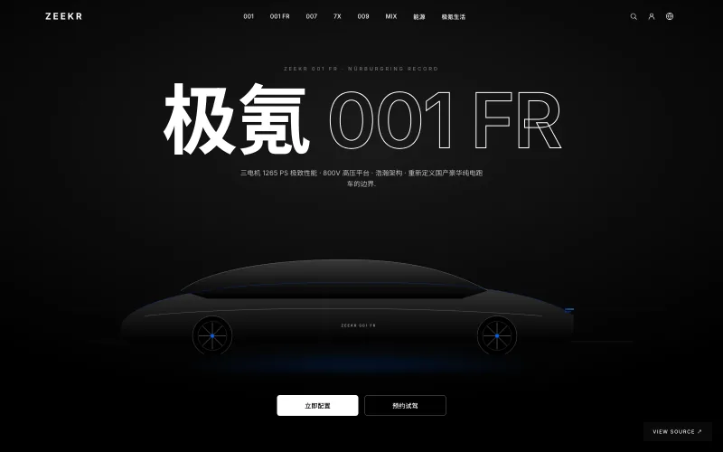<br/><sub><b>极氪 ZEEKR</b></sub></a></td>
</tr>
</table>

### 内容与消费

<table>
<tr>
<td width="25%" align="center"><a href="https://code.jiangshu.ai/awesome-design-html/assets/web/design.bilibili.html">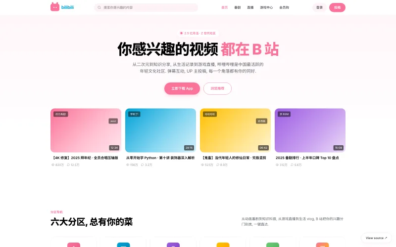<br/><sub><b>哔哩哔哩</b></sub></a></td>
<td width="25%" align="center"><a href="https://code.jiangshu.ai/awesome-design-html/assets/web/design.mihoyo.html">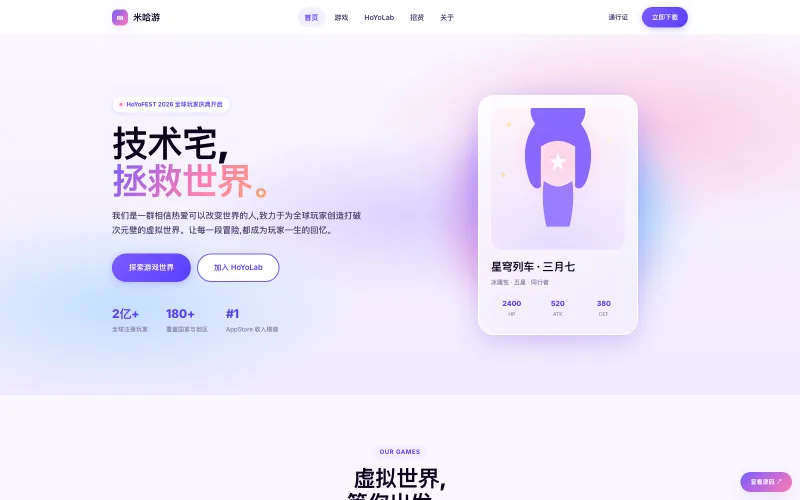<br/><sub><b>米哈游</b></sub></a></td>
<td width="25%" align="center"><a href="https://code.jiangshu.ai/awesome-design-html/assets/web/design.xiaomi.html">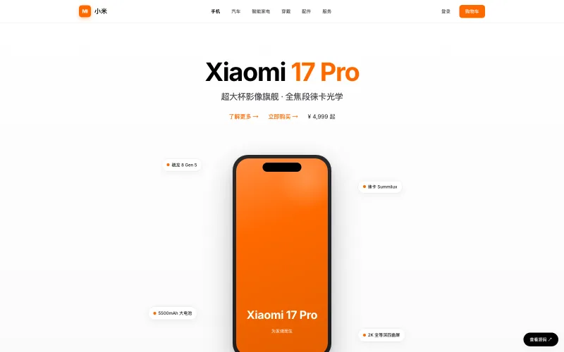<br/><sub><b>小米</b></sub></a></td>
<td width="25%" align="center"><a href="https://code.jiangshu.ai/awesome-design-html/assets/web/design.xiaohongshu.html"><sub><b>小红书 Xiaohongshu</b><br/><i>瀑布流 explore feed</i></sub></a></td>
</tr>
</table>

---

## 📄 网页库 — 93 个营销页

**🇨🇳 中国大厂** — [飞书 Feishu](https://code.jiangshu.ai/awesome-design-html/assets/web/design.feishu.html) · [抖音 Douyin](https://code.jiangshu.ai/awesome-design-html/assets/web/design.douyin.html) · [豆包 Doubao](https://code.jiangshu.ai/awesome-design-html/assets/web/design.doubao.html) · [阿里云 Aliyun](https://code.jiangshu.ai/awesome-design-html/assets/web/design.aliyun.html) · [支付宝 Alipay](https://code.jiangshu.ai/awesome-design-html/assets/web/design.alipay.html) · [钉钉 DingTalk](https://code.jiangshu.ai/awesome-design-html/assets/web/design.dingtalk.html) · [语雀 Yuque](https://code.jiangshu.ai/awesome-design-html/assets/web/design.yuque.html) · [腾讯云 Tencent Cloud](https://code.jiangshu.ai/awesome-design-html/assets/web/design.tencent-cloud.html) · [微信 WeChat](https://code.jiangshu.ai/awesome-design-html/assets/web/design.wechat.html) · [DeepSeek](https://code.jiangshu.ai/awesome-design-html/assets/web/design.deepseek.html) · [Kimi](https://code.jiangshu.ai/awesome-design-html/assets/web/design.kimi.html) · [文心一言 Wenxin](https://code.jiangshu.ai/awesome-design-html/assets/web/design.wenxin.html) · [通义千问 Qwen](https://code.jiangshu.ai/awesome-design-html/assets/web/design.qwen.html) · [Qwen Cloud](https://code.jiangshu.ai/awesome-design-html/assets/web/design.qwencloud.html) · [小米汽车 Xiaomi EV](https://code.jiangshu.ai/awesome-design-html/assets/web/design.xiaomi-ev.html) · [蔚来 NIO](https://code.jiangshu.ai/awesome-design-html/assets/web/design.nio.html) · [理想 Li Auto](https://code.jiangshu.ai/awesome-design-html/assets/web/design.li-auto.html) · [极氪 ZEEKR](https://code.jiangshu.ai/awesome-design-html/assets/web/design.zeekr.html) · [哔哩哔哩 Bilibili](https://code.jiangshu.ai/awesome-design-html/assets/web/design.bilibili.html) · [米哈游 miHoYo](https://code.jiangshu.ai/awesome-design-html/assets/web/design.mihoyo.html) · [小米 Xiaomi](https://code.jiangshu.ai/awesome-design-html/assets/web/design.xiaomi.html) · [小红书 Xiaohongshu](https://code.jiangshu.ai/awesome-design-html/assets/web/design.xiaohongshu.html)


**效率 / SaaS** — [Airtable](https://code.jiangshu.ai/awesome-design-html/assets/web/design.airtable.html) · [Cal.com](https://code.jiangshu.ai/awesome-design-html/assets/web/design.cal.html) · [Intercom](https://code.jiangshu.ai/awesome-design-html/assets/web/design.intercom.html) · [Miro](https://code.jiangshu.ai/awesome-design-html/assets/web/design.miro.html) · [Notion](https://code.jiangshu.ai/awesome-design-html/assets/web/design.notion.html) · [Slack](https://code.jiangshu.ai/awesome-design-html/assets/web/design.slack.html) · [Superhuman](https://code.jiangshu.ai/awesome-design-html/assets/web/design.superhuman.html) · [Webflow](https://code.jiangshu.ai/awesome-design-html/assets/web/design.webflow.html) · [Zapier](https://code.jiangshu.ai/awesome-design-html/assets/web/design.zapier.html) · [Clay](https://code.jiangshu.ai/awesome-design-html/assets/web/design.clay.html)

**开发工具 / IDE** — [Cursor](https://code.jiangshu.ai/awesome-design-html/assets/web/design.cursor.html) · [Figma](https://code.jiangshu.ai/awesome-design-html/assets/web/design.figma.html) · [Framer](https://code.jiangshu.ai/awesome-design-html/assets/web/design.framer.html) · [OpenCode](https://code.jiangshu.ai/awesome-design-html/assets/web/design.opencode.html) · [Raycast](https://code.jiangshu.ai/awesome-design-html/assets/web/design.raycast.html) · [Sanity](https://code.jiangshu.ai/awesome-design-html/assets/web/design.sanity.html) · [Vercel](https://code.jiangshu.ai/awesome-design-html/assets/web/design.vercel.html) · [Warp](https://code.jiangshu.ai/awesome-design-html/assets/web/design.warp.html)

**AI / 大模型** — [Claude](https://code.jiangshu.ai/awesome-design-html/assets/web/design.claude.html) · [Cohere](https://code.jiangshu.ai/awesome-design-html/assets/web/design.cohere.html) · [ElevenLabs](https://code.jiangshu.ai/awesome-design-html/assets/web/design.elevenlabs.html) · [Lovable](https://code.jiangshu.ai/awesome-design-html/assets/web/design.lovable.html) · [MiniMax](https://code.jiangshu.ai/awesome-design-html/assets/web/design.minimax.html) · [Mistral](https://code.jiangshu.ai/awesome-design-html/assets/web/design.mistral.html) · [Ollama](https://code.jiangshu.ai/awesome-design-html/assets/web/design.ollama.html) · [Runway](https://code.jiangshu.ai/awesome-design-html/assets/web/design.runwayml.html) · [Together](https://code.jiangshu.ai/awesome-design-html/assets/web/design.together.html) · [VoltAgent](https://code.jiangshu.ai/awesome-design-html/assets/web/design.voltagent.html) · [xAI](https://code.jiangshu.ai/awesome-design-html/assets/web/design.xai.html)

**基础设施** — [Composio](https://code.jiangshu.ai/awesome-design-html/assets/web/design.composio.html) · [ClickHouse](https://code.jiangshu.ai/awesome-design-html/assets/web/design.clickhouse.html) · [HashiCorp](https://code.jiangshu.ai/awesome-design-html/assets/web/design.hashicorp.html) · [Mintlify](https://code.jiangshu.ai/awesome-design-html/assets/web/design.mintlify.html) · [MongoDB](https://code.jiangshu.ai/awesome-design-html/assets/web/design.mongodb.html) · [PostHog](https://code.jiangshu.ai/awesome-design-html/assets/web/design.posthog.html) · [Replicate](https://code.jiangshu.ai/awesome-design-html/assets/web/design.replicate.html) · [Resend](https://code.jiangshu.ai/awesome-design-html/assets/web/design.resend.html) · [Sentry](https://code.jiangshu.ai/awesome-design-html/assets/web/design.sentry.html) · [Supabase](https://code.jiangshu.ai/awesome-design-html/assets/web/design.supabase.html)

**金融 / 加密** — [Binance](https://code.jiangshu.ai/awesome-design-html/assets/web/design.binance.html) · [Coinbase](https://code.jiangshu.ai/awesome-design-html/assets/web/design.coinbase.html) · [Kraken](https://code.jiangshu.ai/awesome-design-html/assets/web/design.kraken.html) · [Mastercard](https://code.jiangshu.ai/awesome-design-html/assets/web/design.mastercard.html) · [Revolut](https://code.jiangshu.ai/awesome-design-html/assets/web/design.revolut.html) · [Stripe](https://code.jiangshu.ai/awesome-design-html/assets/web/design.stripe.html) · [Wise](https://code.jiangshu.ai/awesome-design-html/assets/web/design.wise.html)

**汽车 / 奢华** — [BMW](https://code.jiangshu.ai/awesome-design-html/assets/web/design.bmw.html) · [BMW M](https://code.jiangshu.ai/awesome-design-html/assets/web/design.bmw-m.html) · [Bugatti](https://code.jiangshu.ai/awesome-design-html/assets/web/design.bugatti.html) · [Ferrari](https://code.jiangshu.ai/awesome-design-html/assets/web/design.ferrari.html) · [Lamborghini](https://code.jiangshu.ai/awesome-design-html/assets/web/design.lamborghini.html) · [Renault](https://code.jiangshu.ai/awesome-design-html/assets/web/design.renault.html) · [Tesla](https://code.jiangshu.ai/awesome-design-html/assets/web/design.tesla.html)

**消费 / 电商** — [Airbnb](https://code.jiangshu.ai/awesome-design-html/assets/web/design.airbnb.html) · [Nike](https://code.jiangshu.ai/awesome-design-html/assets/web/design.nike.html) · [Pinterest](https://code.jiangshu.ai/awesome-design-html/assets/web/design.pinterest.html) · [Shopify](https://code.jiangshu.ai/awesome-design-html/assets/web/design.shopify.html) · [Spotify](https://code.jiangshu.ai/awesome-design-html/assets/web/design.spotify.html) · [Starbucks](https://code.jiangshu.ai/awesome-design-html/assets/web/design.starbucks.html) · [Uber](https://code.jiangshu.ai/awesome-design-html/assets/web/design.uber.html)

**企业 / 平台** — [Apple](https://code.jiangshu.ai/awesome-design-html/assets/web/design.apple.html) · [Expo](https://code.jiangshu.ai/awesome-design-html/assets/web/design.expo.html) · [IBM](https://code.jiangshu.ai/awesome-design-html/assets/web/design.ibm.html) · [Meta](https://code.jiangshu.ai/awesome-design-html/assets/web/design.meta.html) · [NVIDIA](https://code.jiangshu.ai/awesome-design-html/assets/web/design.nvidia.html)

**媒体 / 游戏 / 通信** — [PlayStation](https://code.jiangshu.ai/awesome-design-html/assets/web/design.playstation.html) · [SpaceX](https://code.jiangshu.ai/awesome-design-html/assets/web/design.spacex.html) · [The Verge](https://code.jiangshu.ai/awesome-design-html/assets/web/design.theverge.html) · [Vodafone](https://code.jiangshu.ai/awesome-design-html/assets/web/design.vodafone.html) · [Wired](https://code.jiangshu.ai/awesome-design-html/assets/web/design.wired.html)

---

## 📱 iOS 库 — 22 个 app 仿真

**音乐 / 视频** — [Spotify](https://code.jiangshu.ai/awesome-design-html/assets/ios/design.spotify-ios.html) · [Apple Music](https://code.jiangshu.ai/awesome-design-html/assets/ios/design.apple-music-ios.html) · [YouTube](https://code.jiangshu.ai/awesome-design-html/assets/ios/design.youtube-ios.html) · [Netflix](https://code.jiangshu.ai/awesome-design-html/assets/ios/design.netflix-ios.html) · [TikTok](https://code.jiangshu.ai/awesome-design-html/assets/ios/design.tiktok-ios.html)

**社交** — [Instagram](https://code.jiangshu.ai/awesome-design-html/assets/ios/design.instagram-ios.html) · [Threads](https://code.jiangshu.ai/awesome-design-html/assets/ios/design.threads-ios.html) · [X / Twitter](https://code.jiangshu.ai/awesome-design-html/assets/ios/design.x-twitter-ios.html) · [Snapchat](https://code.jiangshu.ai/awesome-design-html/assets/ios/design.snapchat-ios.html)

**通讯** — [WhatsApp](https://code.jiangshu.ai/awesome-design-html/assets/ios/design.whatsapp-ios.html) · [Telegram](https://code.jiangshu.ai/awesome-design-html/assets/ios/design.telegram-ios.html) · [Discord](https://code.jiangshu.ai/awesome-design-html/assets/ios/design.discord-ios.html)

**AI / 效率** — [ChatGPT](https://code.jiangshu.ai/awesome-design-html/assets/ios/design.chatgpt-ios.html) · [Notion](https://code.jiangshu.ai/awesome-design-html/assets/ios/design.notion-ios.html)

**出行** — [Uber](https://code.jiangshu.ai/awesome-design-html/assets/ios/design.uber-ios.html) · [Airbnb](https://code.jiangshu.ai/awesome-design-html/assets/ios/design.airbnb-ios.html)

**约会** — [Tinder](https://code.jiangshu.ai/awesome-design-html/assets/ios/design.tinder-ios.html) · [Hinge](https://code.jiangshu.ai/awesome-design-html/assets/ios/design.hinge-ios.html)

**美食 / 金融 / 学习** — [Starbucks](https://code.jiangshu.ai/awesome-design-html/assets/ios/design.starbucks-ios.html) · [DoorDash](https://code.jiangshu.ai/awesome-design-html/assets/ios/design.doordash-ios.html) · [Robinhood](https://code.jiangshu.ai/awesome-design-html/assets/ios/design.robinhood-ios.html) · [Duolingo](https://code.jiangshu.ai/awesome-design-html/assets/ios/design.duolingo-ios.html)

---

## 📂 目录结构

```
awesome-design-html/
├── SKILL.md         # Skill 配置 — Claude 读这个获取触发词
├── README.md        # 英文版
├── README.zh-CN.md  # 本文件
├── LICENSE          # MIT
├── index.html       # 画廊入口页
└── assets/
    ├── web/         # 93 个网页 HTML
    └── ios/         # 22 个 iOS app HTML
```

每个 HTML 文件都是完全独立的:内联 `<style>` 块包含所有 design token (CSS `:root` 自定义属性),通过 CDN 加载 Google Fonts,品牌真实组件齐全,右下角有"View source"链接回到这个仓库。

---

## 📝 协议

[MIT](LICENSE) —— 可商用、可修改、可再分发。

网页规范改自 [VoltAgent/awesome-design-md](https://github.com/VoltAgent/awesome-design-md) (MIT)。iOS 规范改自 [Meliwat/awesome-ios-design-md](https://github.com/Meliwat/awesome-ios-design-md)。

---

## 📈 Star 历史

<a href="https://star-history.com/#yzfly/awesome-design-html&Date">
  <picture>
    <source media="(prefers-color-scheme: dark)" srcset="https://api.star-history.com/svg?repos=yzfly/awesome-design-html&type=Date&theme=dark" />
    <source media="(prefers-color-scheme: light)" srcset="https://api.star-history.com/svg?repos=yzfly/awesome-design-html&type=Date" />
    
  </picture>
</a>

---

## 👤 作者

<div>

**云中江树** (yzfly) · 微信公众号: 云中江树

<a href="https://github.com/yzfly"></a>
<a href="https://github.com/yzfly/awesome-design-html/stargazers"></a>

</div>

<br/>

<div align="center">

*如果这个 skill 帮你省了时间,顺手点个 ⭐ 让更多人看到。*

<sub>由 [云中江树](https://github.com/yzfly) ♥ 打造 · MIT 协议</sub>

</div>
